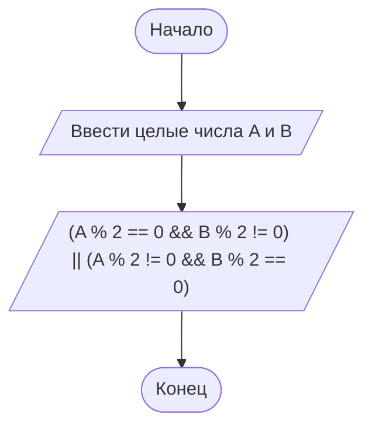

# Домашнее задание — практика 4, вариант 27

В таблице домашнего задания 20 вариантов. Если продолжить нумерацию по кругу, вариант 27 соответствует варианту **7**.

> Новый пароль действует, если ровно одно из чисел A и B чётное.

## Как понять условие

Если A чётное, а B нечётное — пароль действует. Если A нечётное, а B чётное — тоже действует. Если оба числа чётные или оба нечётные — не действует.

Программа выводит **1**, когда пароль действует, и **0**, когда не действует.

| A и B | Вывод | Объяснение |
| --- | ---: | --- |
| 4 и 7 | 1 | Первое чётное, второе нечётное |
| 5 и 8 | 1 | Первое нечётное, второе чётное |
| 4 и 8 | 0 | Оба числа чётные |
| 5 и 9 | 0 | Оба числа нечётные |

## Блок-схема

## Запуск

В программе дойди до приглашения домашнего задания и введи два целых числа через пробел. Например, **4 7**. В Visual Studio запуск — **Ctrl+F5**.

[Материалы домашнего задания к практике 4](https://sites.google.com/view/course-of-study1-c/практика/работа-4)